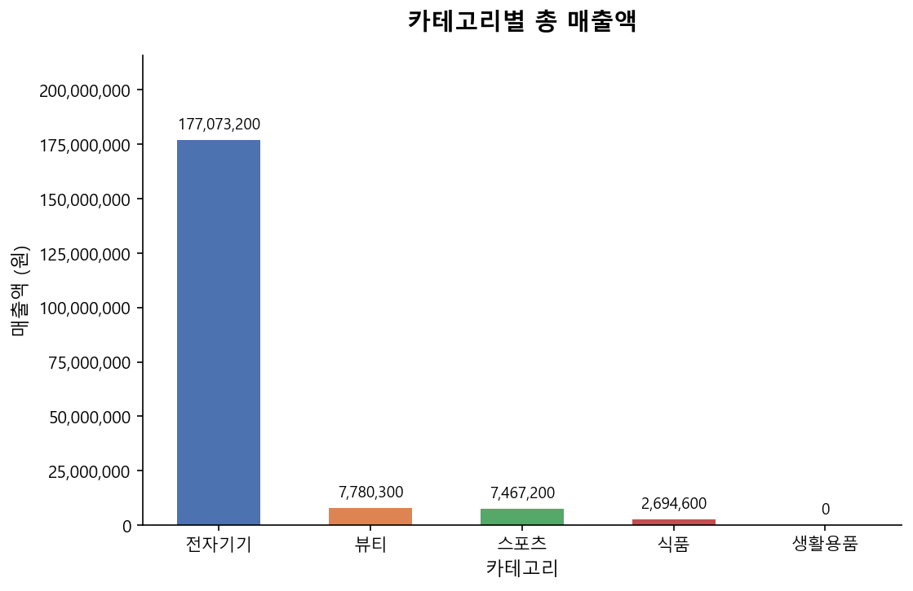
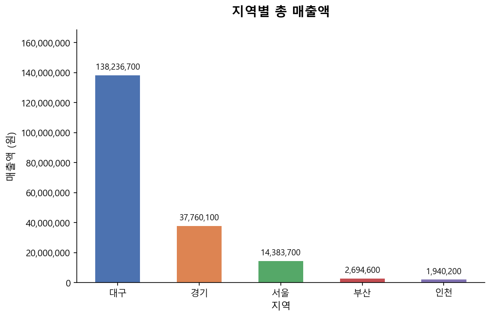
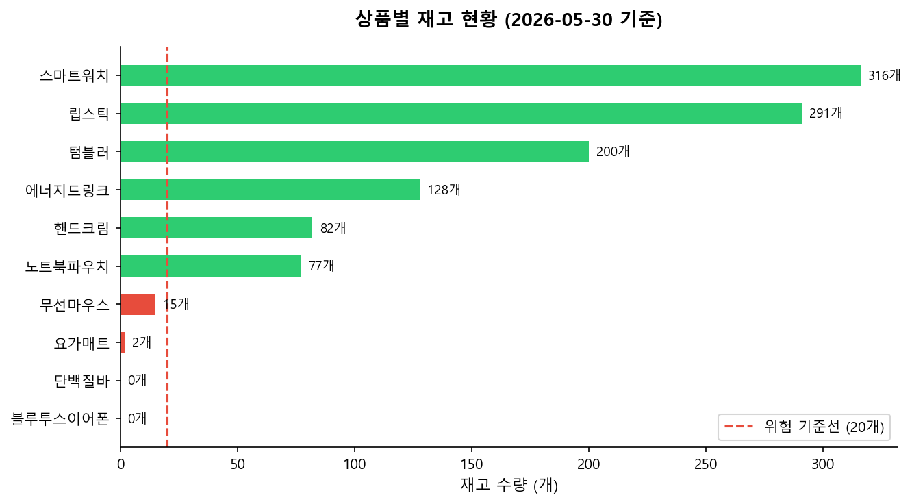
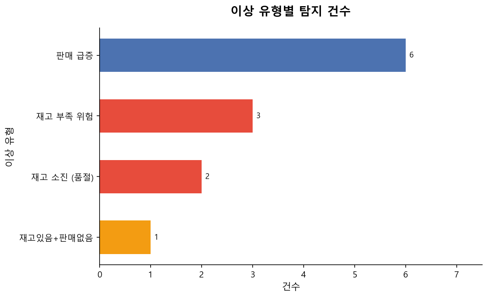
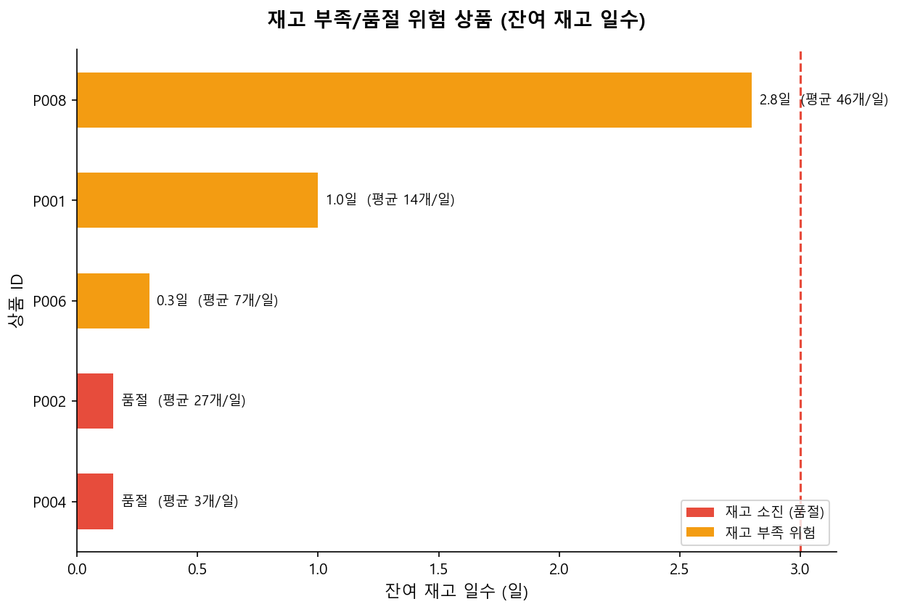
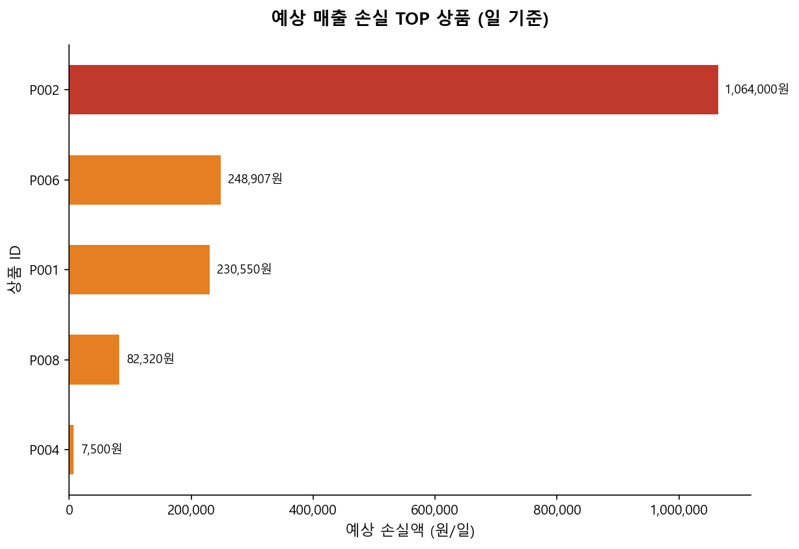

# 유통 판매 이상 탐지 리포트

**생성일:** 2026-05-25  
**분석 기간:** 2026-05-01 ~ 2026-05-30

---

## 요약

| 항목 | 값 |
|------|-----|
| 분석 상품 수 | 10개 |
| 분석 기간 | 30일 |
| 총 판매량 | 4,399개 |
| 총 매출액 | 195,015,300원 |
| 이상 탐지 건수 | 12건 |
| 예상 매출 손실 (재고 이슈) | 1,633,277원/일 |

## 일자별 판매 현황

| 날짜 | 총 판매량 | 총 매출액 |
|------|----------|----------|
| 2026-05-01 | 170개 | 3,301,400원 |
| 2026-05-02 | 174개 | 2,969,900원 |
| 2026-05-03 | 173개 | 3,161,300원 |
| 2026-05-04 | 175개 | 3,462,800원 |
| 2026-05-05 | 143개 | 3,110,600원 |
| 2026-05-06 | 137개 | 2,859,800원 |
| 2026-05-07 | 142개 | 2,930,700원 |
| 2026-05-08 | 148개 | 3,055,700원 |
| 2026-05-09 | 124개 | 3,209,100원 |
| 2026-05-10 | 127개 | 2,772,700원 |
| 2026-05-11 | 141개 | 7,306,100원 |
| 2026-05-12 | 159개 | 9,737,800원 |
| 2026-05-13 | 124개 | 6,311,200원 |
| 2026-05-14 | 102개 | 6,253,700원 |
| 2026-05-15 | 135개 | 7,128,300원 |
| 2026-05-16 | 235개 | 13,260,700원 |
| 2026-05-17 | 170개 | 8,617,500원 |
| 2026-05-18 | 109개 | 6,971,000원 |
| 2026-05-19 | 122개 | 7,892,100원 |
| 2026-05-20 | 119개 | 6,748,100원 |
| 2026-05-21 | 123개 | 6,755,400원 |
| 2026-05-22 | 111개 | 7,252,200원 |
| 2026-05-23 | 259개 | 13,652,900원 |
| 2026-05-24 | 248개 | 12,824,200원 |
| 2026-05-25 | 141개 | 9,207,800원 |
| 2026-05-26 | 128개 | 8,234,900원 |
| 2026-05-27 | 122개 | 6,272,500원 |
| 2026-05-28 | 105개 | 6,874,200원 |
| 2026-05-29 | 126개 | 6,953,200원 |
| 2026-05-30 | 107개 | 5,927,500원 |

## 카테고리별 매출

| 카테고리 | 총 판매량 | 총 매출액 |
|---------|----------|----------|
| 전자기기 | 2,202개 | 177,073,200원 |
| 뷰티 | 527개 | 7,780,300원 |
| 스포츠 | 208개 | 7,467,200원 |
| 식품 | 1,462개 | 2,694,600원 |
| 생활용품 | 0개 | 0원 |

## 지역별 매출

| 지역 | 총 판매량 | 총 매출액 |
|-----|----------|----------|
| 대구 | 967개 | 138,236,700원 |
| 경기 | 1,109개 | 37,760,100원 |
| 서울 | 643개 | 14,383,700원 |
| 부산 | 1,462개 | 2,694,600원 |
| 인천 | 218개 | 1,940,200원 |

## 재고 현황

| 상품명 | 카테고리 | 현재 재고 | 상태 |
|-------|---------|---------|------|
| 블루투스이어폰 | 전자기기 | 0개 | [위험] |
| 단백질바 | 식품 | 0개 | [위험] |
| 요가매트 | 스포츠 | 2개 | [위험] |
| 무선마우스 | 전자기기 | 15개 | [위험] |
| 노트북파우치 | 전자기기 | 77개 | [정상] |
| 핸드크림 | 뷰티 | 82개 | [정상] |
| 에너지드링크 | 식품 | 128개 | [정상] |
| 텀블러 | 생활용품 | 200개 | [정상] |
| 립스틱 | 뷰티 | 291개 | [정상] |
| 스마트워치 | 전자기기 | 316개 | [정상] |

## 이상 탐지 결과

### 판매 급증 (6건)

| 날짜 | 상품 | 카테고리 | 값 | 상세 내용 |
|------|-----|---------|-----|---------|
| 2026-05-01 | 단백질바 | 식품 | 28 | 판매 급증: 28개 판매 (평균 3.0개, z=3.06) |
| 2026-05-02 | 단백질바 | 식품 | 27 | 판매 급증: 27개 판매 (평균 3.0개, z=2.94) |
| 2026-05-03 | 단백질바 | 식품 | 26 | 판매 급증: 26개 판매 (평균 3.0개, z=2.82) |
| 2026-05-16 | 블루투스이어폰 | 전자기기 | 124 | 판매 급증: 124개 판매 (평균 26.7개, z=2.56) |
| 2026-05-23 | 블루투스이어폰 | 전자기기 | 146 | 판매 급증: 146개 판매 (평균 26.7개, z=3.14) |
| 2026-05-24 | 블루투스이어폰 | 전자기기 | 129 | 판매 급증: 129개 판매 (평균 26.7개, z=2.69) |

### 재고 소진 (품절) (2건)

| 날짜 | 상품 | 카테고리 | 값 | 상세 내용 |
|------|-----|---------|-----|---------|
| 2026-05-30 | 블루투스이어폰 | 전자기기 | 0 | 재고 소진: 현재 0개 / 평균 26.7개/일 판매 / 예상 손실 1,064,000원/일 |
| 2026-05-30 | 단백질바 | 식품 | 0 | 재고 소진: 현재 0개 / 평균 3.0개/일 판매 / 예상 손실 7,500원/일 |

### 재고 부족 위험 (3건)

| 날짜 | 상품 | 카테고리 | 값 | 상세 내용 |
|------|-----|---------|-----|---------|
| 2026-05-30 | 무선마우스 | 전자기기 | 15 | 재고 위험: 현재 15개 (1.0일치) / 평균 14.5개/일 판매 / 예상 손실 230,550원/일 |
| 2026-05-30 | 요가매트 | 스포츠 | 2 | 재고 위험: 현재 2개 (0.3일치) / 평균 6.9개/일 판매 / 예상 손실 248,907원/일 |
| 2026-05-30 | 에너지드링크 | 식품 | 128 | 재고 위험: 현재 128개 (2.8일치) / 평균 45.7개/일 판매 / 예상 손실 82,320원/일 |

### 재고있음 + 판매없음 (1건)

| 날짜 | 상품 | 카테고리 | 값 | 상세 내용 |
|------|-----|---------|-----|---------|
| 2026-05-30 | 텀블러 | 생활용품 | 200 | 판매 0, 재고 200개 보유 / 이 상품 평균 판매량 0.0개/일 |

## 자동 인사이트

- 가장 매출이 높은 카테고리는 **전자기기** (177,073,200원)입니다.
- 품절 상품: **블루투스이어폰, 단백질바** — 재고가 0개입니다. 긴급 발주가 필요합니다.
- 재고 부족 위험 상품: **무선마우스, 요가매트, 에너지드링크** — 3일 이내 소진 예상, 즉시 발주 검토가 필요합니다.
- 판매 급증 상품: **단백질바, 블루투스이어폰** — 재고 소진 속도를 모니터링하세요.
- 재고 있음 + 판매 0 상품: **텀블러** — 할인 또는 프로모션 검토를 권장합니다.
- 전체 판매량은 감소 추세입니다 (170개 → 107개).

---
*이 리포트는 자동으로 생성되었습니다.*